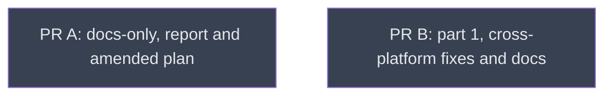

# v0.2.14 — sandbox-aware macOS measurement, in three PRs

## Context
The maintainer accepted the issue #3 field check (comment 5947395182) and asked for the v0.2.14 plan to land as PRs against `main`.
Depth encodes PR order. `docs_pr` is PR A (docs only). `part1/` is PR B (scope items 1, 2, 5, 7, 8). `part1/close/part2/` is PR C (items 3, 4, 6), which must wait for part 1.
The design of record is R01, `docs/roadmap-v0.2.14.md`. This roadmap decides only how that work is split, sequenced, gated and verified.
The campaign lives on the fork-only planning branch `v0214-roadmap` and never enters a PR diff. PR heads: A = `field-check-v0213-macos`, B = `v0214-part1`, C = `v0214-part2`.

## Reference Documents
- [R01 roadmap-v0.2.14](../../docs/roadmap-v0.2.14.md) — design decisions, scope table (items 1–11), the *When it bites* table, the Verification fixtures
- [R02 dogfooding report](../../docs/dogfooding-feedbacks/dogfooding-macos-sandbox-eperm-and-device-bounds.md) — the field report: findings, the doc-site list, the misreadings recorded
- [R03 maintainer reply](https://github.com/mi-for-the-rust-of-us/hypomnesis/issues/3#issuecomment-5947395182) — the PR split, API names, remedy wording, three additions (kinfo_proc architectures, macos-latest CI, Claude Code sandbox row)
- [R04 field_check_v0213 evidence](../../__reports__/field_check_v0213/README.md) — findings v1, the probes (sandbox_probe.py, sandbox_sysctl_probe.py, kern_proc_pid_probe.py, rs/, appsandbox/)
- [R05 ROADMAP.md](../../ROADMAP.md) — Principle 2 (additive in patches), Principle 3 (hardware owners test), Principle 4, untested hardware, Speculative v0.3.0
- [R06 CONVENTIONS.md](../../CONVENTIONS.md) — crate conventions, the macOS syscall list (around line 246)
- [R07 roadmap-v0.2.13](../../docs/roadmap-v0.2.13.md) — process_exists, --exit-status, and the decision to skip a failing device when --device is not given
- [R08 coverage matrix](../../__reports__/v0214_roadmap/01-coverage_matrix_v0.md) — every scope item, every point of the reply, every code and doc site, mapped to a leaf and step

## Goal
Ship v0.2.14 as PRs A, B and C, each green on CI and each matching R01 as amended by R03, with no silent wrong answer left in `hmn ps` or `hmn watch` on macOS.

## Pre-conditions
- [x] Maintainer approval to implement, as PRs against `main` (R03)
- [x] Baseline gate set green at c1810a5 (Phase 0: fmt, clippy default / all-features / x86_64-unknown-linux-gnu, test 338 passed 11 ignored, doc -D warnings, cargo +1.88 check, x86_64-apple-darwin lib tests under Rosetta 83 passed)
- [x] Baseline gate set green again at the rebased planning base 40a701e (docs commits on upstream a602e05), on stable 1.99: all nine gates exit 0 (fmt, clippy ×3, test 338 passed 11 ignored, doc, cargo +1.88 check, x86_64-apple-darwin lib tests 83 passed under Rosetta, release build)
- [x] Local stable toolchain 1.99.0, matching CI (`rustup update stable`, 2026-10-02, with the user's yes)
- [x] Environment measured: rustup stable 1.92 + 1.88, targets x86_64-unknown-linux-gnu and x86_64-apple-darwin, Rosetta, /usr/bin/sandbox-exec, gh logged in as LittleCoinCoin, no cargo-nextest, CARGO_TARGET_DIR unset

## Success Gates
- ⬜ PR A, PR B and PR C opened against mi-for-the-rust-of-us/hypomnesis `main`, each with every CI job green (ubuntu / windows / macos-latest × 1.88 / stable, and the Doc check), confirmed by `gh pr checks <n>`
- ⬜ Every leaf `done` in `dirtree-rdm ls` at every level, with no node left at `amendment`
- ⬜ R01 scope items 1–8 and 11 show ✅, and R01's Verification section is filled from field runs, not left "to be filled in"
- ⬜ Every row of R08 is checked off against a merged commit

## Gotchas
ENVIRONMENT CONTRACT (measured in Phase 0, 2026-10-02). This is a pure-Rust crate, so there is no mamba or uv: run `cargo` locally inside your own worktree. `cargo metadata` in a fresh worktree reports that worktree as workspace_root, and target/ inside it. Never set CARGO_TARGET_DIR to a shared path, or the tests measure another checkout.
Gate set, each judged by its exit status (no nextest is installed, so never by reading terminal text): `cargo fmt --check`; `cargo clippy --locked --all-targets -- -D warnings`; the same with `--all-features`; the same with `--all-features --target x86_64-unknown-linux-gnu`; `cargo test --locked --all-features`; `RUSTDOCFLAGS="-D warnings" cargo doc --all-features --no-deps`; `cargo +1.88 check --locked --all-features` (MSRV); `cargo check --locked --no-default-features`; `cargo check --locked --no-default-features --features nvml,dxgi,pdh` (both from ci.yml); `cargo +1.88 clippy --locked --all-targets --all-features -- -D warnings` and `cargo +1.88 test --locked --all-features` (CI's 1.88 leg). This set is shared hygiene, not a leaf gate. CLI gates call `$PWD/target/debug/hmn` or `$PWD/target/release/hmn` and name the build command; a bare `hmn` resolves to an old `~/.cargo/bin/hmn` 0.2.3.
Any build with `--all-features` (debug or release) enables the opt-in `debug-output` feature, and `hmn` then prints `[nvidia-smi debug] ...` lines on stderr. TWO BUILD MODES: gate checks may use the `--all-features` debug binary, matching a stderr substring or line prefix, never the whole of stderr; byte-comparison captures (capture.sh/compare.sh) use `cargo build --release --locked` with default features.
SHELL: the user's and the Bash tool's shell is zsh, where MULTIOS makes `cmd 2>&1 >/dev/null | ...` carry stdout too (14 lines against bash's 1, measured). Every CLI gate runs as `bash -c '...'`.
UPSTREAM DRIFT (found while drafting): upstream main moved past cf5ada0 to a602e05. 587a6d5 is test-only clippy 1.99 `assert_is_empty` fixes in ps.rs, watch.rs, main.rs, nvml.rs, pdh.rs and spill.rs; a602e05 bumps a CI action. Line numbers in leaves are c1810a5-relative, so re-locate each site by symbol on the integration base. PR B and PR C branch from, and rebase onto, the current upstream main. PR A is unaffected (docs only).
TOOLCHAIN DRIFT: CI's stable is 1.99 and local stable is 1.92. Clippy 1.99 rejects `assert!(x.is_empty())`, so write `assert!(x.is_empty(), "{x:?}")` as 587a6d5 does. Run `rustup update stable` (with the user's yes) before PR B so the local clippy gate matches CI.
COLGREP IN WORKTREES: shell `grep -r`/`rg` are blocked. In a fresh worktree, call colgrep `index_status`, then `index_build` on the worktree's absolute path, before the first search, and pass that path on every `search`. Otherwise hits come from the main checkout. Plain `grep` on one known file is allowed.
GATE CONTRACT (every leaf obeys it; verifiers attack against it). (1) Each `[run]` gate names its evidence: a test function plus the assertion it pins, or an exact CLI invocation plus its exit code and a stderr/stdout substring, or a `grep -c` plus its expected count. "Build passes" or "tests pass" is never a leaf gate. (2) Each behavioural gate states before → after, the before measured on c1810a5. A gate whose before equals its after is rejected. (3) Every gate ends with "catches: <a plausible wrong implementation it rejects>". (4) A test-first step's expected FAIL comes from an assertion, never from a missing symbol: stub first, then the test. (5) "Windows/Linux output unchanged" is proven by an existing pinned test or a captured baseline file, never asserted. (6) Each pre-condition, and every cross-leaf reference, quotes the other leaf's gate text, never a gate number (two numbering schemes were in use), or cites a Phase 0 fact above. (7) An expected-FAIL check runs `cargo test ... --no-fail-fast 2>&1` and shows `grep -c 'panicked at'` ≥ N and `grep -c 'error\[E'` = 0. (8) An expected-PASS test-filter check first proves the filter matches exactly N tests: `cargo test ... <filter> -- --list 2>/dev/null | grep -c ': test$'` = N. (9) A gate labelled `(guard)` may have before = after, but only beside a moving gate. (10) A phrase gate on a hard-wrapped file (main.rs help, README, FAQ, tutorials) greps a short token, or its step says the phrase is kept on one line.
LEAF GRAMMAR: each header gate is one line starting `- ⬜ `, and each pre-condition is one line starting `- [ ] `. A Consistency Checks line ends with `(expected: PASS)` or `(expected: FAIL)`. Commit types are feat|fix|test|docs|chore|refactor|style|perf|ci|build|revert, with a lowercase scope. There are at most 5 steps, and a step is one commit. Before-values and mutation notes go inline in the gate line or in the Implementation Logic body.
BASELINES measured at c1810a5, behaviour-identical at 40a701e since 587a6d5 only changes test assertions (debug hmn, M3 Pro, macOS 26.6.2, unsandboxed Bash, report profile P = `(version 1)(allow default)(deny process-info*)(allow process-info* (target self))`): `hmn ps` → exit 0, rows incl. WindowServer, SPILL cells `?`. `sandbox-exec -p P hmn ps` → exit 0, stderr `hmn: 0 GPU processes found.`. Under P, `ps --device 0` → exit 2, `hmn: ps failed to query device 0: no GPU measurement source available (NVML, DXGI, PDH, and nvidia-smi all failed or are disabled)`. Under P, `ps --exit-status` → exit 1. `hmn ps --device 1` → exit 2 with the same NoGpuSource body for device 1. `hmn watch 0 --duration 2s --interval 1s` → exit 0, stderr `hmn watch: pid=0 names no running process; its rows will read 0 MiB`. Under P, `watch 1 --duration 2s` → exit 2, `hmn: watch failed to query device 0: no GPU measurement source available ...`. `ps --pid 4294967295 --exit-status` → exit 1. SELF ROW (found in round 1): hmn holds a 16 KiB graphics footprint of its own. `hmn ps --json` lists its own PID at 16384 bytes, unsandboxed and under D. `watch --filter hmn` selects it. Its own ledger read is allowed under P and S0. So once enumeration works inside a sandbox (PR C), `entries` holds hmn's row wherever hmn can read itself. Pre-conditions cite ci.yml or source files directly, never as Phase 0 facts the README does not carry.
OWNERSHIP: the `--help` text, rustdoc and CHANGELOG `[Unreleased]` line that a change makes stale are updated in the same leaf as the code, by the leaf that makes the change. A docs step after the code step is fine, because the PR merges the leaf whole. Parallel PR B leaves make non-adjacent edits to ps.rs, format.rs and tests/macos_smoke.rs, and add CHANGELOG lines; the coordinator resolves those textual conflicts at rebase. `kinfo.rs` items used only by metal.rs carry `#[cfg(all(target_os = "macos", feature = "metal"))]`, or Linux clippy fails on dead code. The canonical macOS limitation statement is written by `part1_close` (as part 1 ships it) and rewritten by `part2_close`. R01's Verification section and scope statuses belong to the two `*_close` leaves. The `kinfo_proc` parser belongs to `process_exists_kinfo`, and `kinfo_enumeration` extends it.
VERIFIERS, decided at authoring: docs_pr, process_exists_kinfo, ps_failed_devices, remedy_macos, part1_close, kinfo_enumeration, gpu_process_listing, ps_watch_unreadable and part2_close each get an adversarial Sonnet verifier before merge. metal_bounds_check and spill_cell_na are mechanical and merge on the implementer's report.
RED COMMITS (user decision U3, 2026-10-03): TDD keeps one red commit per test-first step on the task branch. Before the coordinator pushes a PR branch, each red commit is squashed into its green successor (`git reset --soft <before-red>` then recommit with `git commit -F`), so every pushed commit passes the gate set. A Step 1 stub must still compile, so the expected FAIL is an assertion. SQUASH SCOPE: a pushed commit must be green, so a red step's tests must all turn green in the very next step. Otherwise the leaf states its squash group (e.g. "Steps 1–3 push as one commit"), or moves those tests to the step that greens them.
SANDBOX HARNESS: one harness, owned by part1/close/part1_close: `__reports__/v0214_part1/harness/{sandbox.sh,capture.sh,compare.sh}`. Profiles: P (report), Q (P + deny kern.proc), S (P + allow same-sandbox, always run under a bash wrapper so a resident sibling exists), S0 (S run directly: behaves like P), D (deny process-info-pidinfo except self), L (deny process-info-ledger only), C (Codex base policy pinned to an openai/codex commit, plus allow file-read*). PR C extends this harness and never forks it.
CLIPPY IN TESTS: Cargo.toml denies clippy::panic, unwrap_used, expect_used, wildcard_enum_match_arm, match_wildcard_for_single_variants and indexing_slicing, and warns on as_conversions and the cast_* lints (errors under -D warnings), and CI runs `clippy --all-targets -D warnings`. So test code uses a Cell<bool> or AtomicBool flag instead of a panicking closure, uses explicit match arms with no `_`, `.get(..)` instead of `[..]`, `try_from` instead of `as`, and writes a per-fn `#[allow(clippy::expect_used)] // test-only` where it must, as tests/macos_smoke.rs does.
OUTWARD ACTIONS: pushing a branch, opening a PR and posting a comment each need the user's explicit yes, every time.

## Status

## Nodes
| Node | Type | Status |
|:-----|:-----|:-------|
| `docs_pr.md` | 📄 Leaf Task | ⬜ Planned |
| `part1/` | 📁 Directory | ⬜ Planned |

## Amendment Log
| ID | Date | Source | Nodes Added | Rationale |
|:---|:-----|:-------|:------------|:----------|

## Progress
| Node | Branch | Commits | Notes |
|:-----|:-------|:--------|:------|
