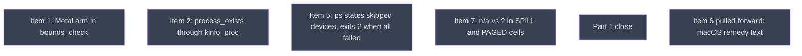

# PR B: part 1, cross-platform fixes and docs

## Context
PR B, head `v0214-part1`, branched from PR A's head and rebased onto `main` once PR A merges. It carries R01 scope items 1, 2, 5, 7 and 8, with their share of item 11, plus the macOS remedy text pulled forward from item 6 (user decision U1).
The five code leaves at this level run in parallel. Their edits are non-adjacent, and the coordinator resolves the textual conflicts in ps.rs, format.rs, tests/macos_smoke.rs and CHANGELOG at rebase. `close/` then restates the macOS limitation and field-checks the PR on hardware.
Item 2's `kinfo_proc` parser is a contract that PR C builds on.

## Goal
Correct the statements that are wrong today and the silent wrong answers that exist on every platform, without new public API.

## Pre-conditions
- [ ] docs_pr gate "PR A is open and CI is green" met, so R01 in the tree records the PR split and the maintainer's decisions
- [ ] Branch `v0214-part1` exists at PR A's head (or at `main` once PR A merged)

## Success Gates
- ⬜ All five leaves at this level and part1_close in close/ are `done` in `dirtree-rdm ls`
- ⬜ `gh pr checks <PR B>`: every job green, including both macos-latest jobs (R03: the exit-2 change must be seen passing on the VM runners, not assumed)
- ⬜ Coordinator seam review recorded in the Progress notes: process_exists_kinfo's parser API is the one kinfo_enumeration's leaf text names, and part1_close's canonical statement describes PR B's behaviour (exit 2 plus a skip line under the report's profile), not PR C's

## Gotchas
No public API is added in PR B. `process_exists` keeps its signature, and its macOS behaviour changes only where it answered wrongly (PID 0) or not at all (sandboxed callers).
PR B goes up as a DRAFT PR (with the user's yes for the push and the PR) as soon as the five code leaves are merged into `v0214-part1`, before part1_close runs, so that macos-latest CI evidence exists for ps_failed_devices' CI gate and part1_close's CI-branch record. It is marked ready for review after part1_close. ps_failed_devices' CI gate can therefore only be checked once that draft push has run CI, which is after the five code leaves are merged. ps_failed_devices is marked `done` at that point, not at merge.
The canonical limitation statement must not promise "measures what is permitted and counts the rest". That is PR C's behaviour. If PR B ships as a release on its own, the docs must be true for it, and so must its runtime hints: remedy_macos removes the macOS "re-run elevated" advice. If PR C never ships, `__reports__/` is dropped by a follow-up before release.

## Status

## Nodes
| Node | Type | Status |
|:-----|:-----|:-------|
| `metal_bounds_check.md` | 📄 Leaf Task | ⬜ Planned |
| `process_exists_kinfo.md` | 📄 Leaf Task | ⬜ Planned |
| `ps_failed_devices.md` | 📄 Leaf Task | ⬜ Planned |
| `spill_cell_na.md` | 📄 Leaf Task | ⬜ Planned |
| `close/` | 📁 Directory | ⬜ Planned |
| `remedy_macos.md` | 📄 Leaf Task | ⬜ Planned |

## Amendment Log
| ID | Date | Source | Nodes Added | Rationale |
|:---|:-----|:-------|:------------|:----------|

## Progress
| Node | Branch | Commits | Notes |
|:-----|:-------|:--------|:------|
