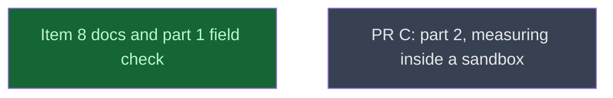

# Part 1 close

## Context
This level runs after the five part-1 code leaves. part1_close rewrites the macOS limitation from evidence across every doc site, field-checks PR B on the M3 Pro, and captures the baselines that PR C's byte-identical checks compare against. `part2/` (PR C) is one level deeper and waits for it.

## Goal
Leave PR B's docs true for PR B's behaviour, proven on hardware, with baselines saved for PR C.

## Pre-conditions
- [ ] metal_bounds_check, process_exists_kinfo, ps_failed_devices, spill_cell_na and remedy_macos all `done` and merged into `v0214-part1`

## Success Gates
- ⬜ part1_close `done`, and its verifier's findings adjudicated in the Progress notes
- ⬜ part1_close's capture gate holds on `v0214-part1`: `find __reports__/v0214_part1/pr_b __reports__/v0214_part1/c1810a5 -name '*.exit' | wc -l` → 36

## Gotchas
The hardware checks need the user's machine and, for the Claude Code sandbox row, the user's help to enable the sandbox. Ask the user. Do not substitute an unsandboxed run.

## Status

## Nodes
| Node | Type | Status |
|:-----|:-----|:-------|
| `part1_close.md` | 📄 Leaf Task | ✅ Done |
| `part2/` | 📁 Directory | ⬜ Planned |

## Amendment Log
| ID | Date | Source | Nodes Added | Rationale |
|:---|:-----|:-------|:------------|:----------|
| A3 | 2026-10-05 | `__reports__/v0214_roadmap/08-amendment_a3_part1_close_revision_v0.md` | [] (part1_close deliverables revised) | Verifier notes adjudicated with the user: harness ported to Python (`capture.py`, `compare.py`), `ps_json` row count dropped, Codex attribution added, prose made final-state only |

## Progress
| Node | Branch | Commits | Notes |
|:-----|:-------|:--------|:------|
| `part1_close.md` | `task/part1_close` | 8bc9827, 4316c80, a14f197, 434fb71, 395f324 (on PR B, mi-for-the-rust-of-us/hypomnesis#7), then coordinator commit 4d32647 (`__reports__/v0214_part1/01-reviews_v0.md`, the review record) | All header gates PASS; 18/18 field-check fixtures PASS; 36 `.exit` captures, no raw names. Claude Code row captured by the user in a separate sandboxed session (CC 2.1.273, nested rc 71, `sandboxed: 1`, `SANDBOX_RUNTIME=1`): both builds list normally (18 processes, rc 0), so PR B is never exit 0 with `0 GPU processes found` there; its `hmn-commit` 4a849e0 is Step 3 before A3 rewrote the branch (findings *History*). CI branch record from run 37210951264: 4 macOS lines, all `branch=expected`. Verifier 1 (Sonnet): PASS WITH NOTES, adjudicated with the user as amendment A3 (Python `capture.py`/`compare.py`, `ps_json` keys only, Codex Apache-2.0 attribution in `CODEX_PIN`, final-state prose, `Known residual:` paragraph removed). Verifier 2 (Sonnet, A3 delta): PASS WITH NOTES; its meta-discourse hits (README item 9 'in this release', the CHANGELOG bullet, ROADMAP 'still', README 'only a sandbox') fixed in Step 1. User decision kept: statement (iii) as drafted. Codex pin 696b450, SHA-256 5103332d… = drafting copy. App Sandbox build runs only from outside `~/Documents` (SIGTRAP 133 in place, likely TCC). Every pushed commit green on the full gate set (72/72 for fdf2f6c..4d32647). |
