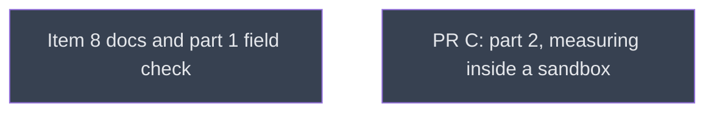

# Part 1 close

## Context
This level runs after the five part-1 code leaves. part1_close rewrites the macOS limitation from evidence across every doc site, field-checks PR B on the M3 Pro, and captures the baselines that PR C's byte-identical checks compare against. `part2/` (PR C) is one level deeper and waits for it.

## Goal
Leave PR B's docs true for PR B's behaviour, proven on hardware, with baselines saved for PR C.

## Pre-conditions
- [ ] metal_bounds_check, process_exists_kinfo, ps_failed_devices, spill_cell_na and remedy_macos all `done` and merged into `v0214-part1`

## Success Gates
- ⬜ part1_close `done`, and its verifier's findings adjudicated in the Progress notes
- ⬜ part1_close's capture gate holds on `v0214-part1`: `find __reports__/v0214_part1/pr_b __reports__/v0214_part1/c1810a5 -name '*.exit' | wc -l` → 36

## Gotchas
The hardware checks need the user's machine and, for the Claude Code sandbox row, the user's help to enable the sandbox. Ask the user. Do not substitute an unsandboxed run.

## Status

## Nodes
| Node | Type | Status |
|:-----|:-----|:-------|
| `part1_close.md` | 📄 Leaf Task | ⬜ Planned |
| `part2/` | 📁 Directory | ⬜ Planned |

## Amendment Log
| ID | Date | Source | Nodes Added | Rationale |
|:---|:-----|:-------|:------------|:----------|

## Progress
| Node | Branch | Commits | Notes |
|:-----|:-------|:--------|:------|
