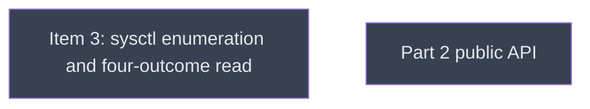

# PR C: part 2, measuring inside a sandbox

## Context
PR C, head `v0214-part2` on the fork, branched from upstream `main` at b716087 ("Merge PR #7", PR B's merge) and rebased onto `main` if `main` moves. It carries R01 items 3, 4 and 6, plus the rest of item 11. Each item is a sequential level, because each consumes the previous one's output: item 3's four-outcome read and denied PIDs, then item 4's public `GpuProcessListing`, then item 6's CLI counts. All three get adversarial review (R03).

## Goal
Measure everything a sandbox permits, state what it forbids by count, and stop reporting an unreadable list as an empty one.

## Pre-conditions
- [ ] part1_close `done`, with its gate `find __reports__/v0214_part1/pr_b __reports__/v0214_part1/c1810a5 -name '*.exit' | wc -l` → 36 met (the baselines PR C compares against; 36 on b716087, measured)
- [ ] Branch `v0214-part2` exists at `PCfVW/main` b716087 (amendment A5: PR B merged, so the base is upstream `main`, not `v0214-part1`'s head)

## Success Gates
- ⬜ kinfo_enumeration, gpu_process_listing, ps_watch_unreadable and part2_close `done` in `dirtree-rdm ls`
- ⬜ `gh pr checks <PR C>`: every job green, including both macos-latest jobs, with tests/cli_ps.rs passing there
- ⬜ Coordinator seam review recorded: the denied PIDs kinfo_enumeration collects are the ones gpu_process_listing exposes, and the ones ps_watch_unreadable counts, with no PID counted twice or dropped

## Gotchas
Every new behaviour is macOS-only by construction. Windows and Linux output stay byte-identical, which pinned tests prove (for example the ps.rs "re-run elevated" tests), not a claim.
`spilled: null` is NOT in this PR (R03, Principle 2).

## Status

## Nodes
| Node | Type | Status |
|:-----|:-----|:-------|
| `kinfo_enumeration.md` | 📄 Leaf Task | ⬜ Planned |
| `api/` | 📁 Directory | ⬜ Planned |

## Amendment Log
| ID | Date | Source | Nodes Added | Rationale |
|:---|:-----|:-------|:------------|:----------|
| A5 | 2026-10-07 | `__reports__/v0214_roadmap/10-amendment_a5_main_rebase_v0.md` | [] (the four PR C leaves revised) | PR B merged as b716087 after its review (A4): base, symbols, test idiom, counts and befores re-measured on main; `KERN_PROC_ALL` record-size guard, same-boot compare base, fail-not-skip sandbox test |

## Progress
| Node | Branch | Commits | Notes |
|:-----|:-------|:--------|:------|
