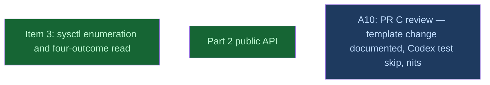

# PR C: part 2, measuring inside a sandbox

## Context
PR C, head `v0214-part2` on the fork, branched from upstream `main` at b716087 ("Merge PR #7", PR B's merge) and rebased onto `main` if `main` moves. It carries R01 items 3, 4 and 6, plus the rest of item 11. Each item is a sequential level, because each consumes the previous one's output: item 3's four-outcome read and denied PIDs, then item 4's public `GpuProcessListing`, then item 6's CLI counts. All three get adversarial review (R03).

## Goal
Measure everything a sandbox permits, state what it forbids by count, and stop reporting an unreadable list as an empty one.

## Pre-conditions
- [ ] part1_close `done`, with its gate `find __reports__/v0214_part1/pr_b __reports__/v0214_part1/c1810a5 -name '*.exit' | wc -l` → 36 met (the baselines PR C compares against; 36 on b716087, measured)
- [ ] Branch `v0214-part2` exists at `PCfVW/main` b716087 (amendment A5: PR B merged, so the base is upstream `main`, not `v0214-part1`'s head)

## Success Gates
- ⬜ kinfo_enumeration, gpu_process_listing, ps_watch_unreadable and part2_close `done` in `dirtree-rdm ls`, and amendment A10's maintainer_review_c
- ⬜ `gh pr checks <PR C>`: every job green, including both macos-latest jobs, with tests/cli_ps.rs passing there
- ⬜ Coordinator seam review recorded: the denied PIDs kinfo_enumeration collects are the ones gpu_process_listing exposes, and the ones ps_watch_unreadable counts, with no PID counted twice or dropped

## Gotchas
Every new behaviour is macOS-only by construction. Windows and Linux output stay byte-identical, which pinned tests prove (for example the ps.rs "re-run elevated" tests), not a claim.
`spilled: null` is NOT in this PR (R03, Principle 2).

## Status

## Nodes
| Node | Type | Status |
|:-----|:-----|:-------|
| `kinfo_enumeration.md` | 📄 Leaf Task | ✅ Done |
| `api/` | 📁 Directory | ✅ Done |
| `maintainer_review_c/` | 📁 Directory | 🔵 Amendment |

## Amendment Log
| ID | Date | Source | Nodes Added | Rationale |
|:---|:-----|:-------|:------------|:----------|
| A5 | 2026-10-07 | `__reports__/v0214_roadmap/10-amendment_a5_main_rebase_v0.md` | [] (the four PR C leaves revised) | PR B merged as b716087 after its review (A4): base, symbols, test idiom, counts and befores re-measured on main; `KERN_PROC_ALL` record-size guard, same-boot compare base, fail-not-skip sandbox test |
| A6 | 2026-10-07 | `__reports__/v0214_roadmap/11-amendment_a6_kinfo_reviews_v0.md` | [] (kinfo_enumeration revised) | Its three reviews found FFI paths no test reaches: a pure `classify_kinfo_all` + bounded `fill_kinfo_all_with`, `comm_from_lookup`, `pidpath_failure` tests, non-vacuous harness scripts, exact `None` docs |
| A7 | 2026-10-07 | `__reports__/v0214_roadmap/12-amendment_a7_gpl_reviews_v0.md` | [] (gpu_process_listing revised) | Its reviews found mutants no CI test catches: a denied PID off macOS (vacuous no-GPU test), a fake unsandboxed denial, a remedy in `Display` past a word list, a truncating count; byte-for-byte `Display`, a helper test, an awk pin, stale comments |
| A8 | 2026-10-07 | `__reports__/v0214_roadmap/13-amendment_a8_pwu_reviews_v0.md` | [] (ps_watch_unreadable revised) | Its reviews found mutants no cargo test catches: a doubled remedy on the skip line, `accept`'s branches, `explicit = false` in watch, a count without its remedy; whole-line matches, a pure `branch`, stricter gate greps, exact `--help` |
| A9 | 2026-10-08 | `__reports__/v0214_roadmap/15-amendment_a9_slim_v0.md` | [] (the three code leaves slimmed) | Three audits against #3, R01 and the maintainer's idiom: seams and seam tests cut, `trust_kinfo_listing` kept, watch's not-followed line aligned to R01; equivalence verified (528 cells, rustdoc JSON), then folded into the leaf commits |
| A10 | 2026-10-09 | `__reports__/v0214_roadmap/17-amendment_a10_pr_c_review_v0.md` | ["maintainer_review_c/"] | Maintainer's CHANGES_REQUESTED on PR C: the unresolved-template change documented (CHANGELOG, R01's fifth item), the `KERN_PROC_ALL` test skips under Codex, seven nits incl. `FootprintRead::Failed` and sorted `denied_pids`; fixups folded per owning commit, the 15 hash mentions repointed |

## Progress
| Node | Branch | Commits | Notes |
|:-----|:-------|:--------|:------|
| `part2/` (PR C) | `v0214-part2` | 10 commits on b716087 as opened (6103aac..c026a93), 8 more before ready (a8a8644..1c97d88) | PR C = mi-for-the-rust-of-us/hypomnesis#8, opened as a draft 2026-10-07, marked ready 2026-10-08 with all 8 CI jobs green on 1c97d88 (run 37711962603; macos-latest `cli_ps` `branch=expected` ×4). Coordinator seam review recorded: the denied PIDs `list_processes` collects are the ones `gpu_process_listing` exposes and `ps`/`watch` count, none twice or dropped, the caller and gone PIDs in none (hmn=947 probe=947; 1058/1058 in the leaf-level runs). The campaign's size was cut in half by A9 (audits against #3, R01 and the maintainer's idiom) before the PR opened. |
| `kinfo_enumeration.md` | `task/kinfo_enumeration` | 6103aac, 9bf9ab0, 1dddc53 on v0214-part2 after A9 (slimmed in place; implemented as 5131725, 73cc80a, 8519f1a; trailer rewritten to `claude-sonnet-5-5`, trees identical; red 578bf07 squashed into Step 2, A6 fixes folded into their steps) | Sonnet implementer; every gate PASS on each commit, full gate set green per commit, lib 138 native and Rosetta. Reviews: spec verifier PASS WITH NOTES (2 should-fix), independent FFI review PASS WITH NOTES (no UB, errno matches XNU under none/P/S/S0/Q/D/L/C; 3 should-fix), test review PASS WITH NOTES (34/34 tests fail on revert; 6 should-fix). A6 adopted them: pure `classify_kinfo_all` + bounded `fill_kinfo_all_with`, `comm_from_lookup`, 9 tests, non-vacuous harness scripts, exact `None` docs; implementer corrections adopted (EPERM un-cfg'd, `b"ab\xe3"` the incomplete tail). A6 delta verifier PASS WITH NOTES: every earlier survivor caught or a stated residual; its notes applied as doc/record fixups. Seam (coordinator): `tally_reads` keeps the caller's row in `found`, never in `others_read` or `denied`; gone PIDs and PIDs ≤ 0 in neither; `legacy_entries` is `None` iff `others_read == 0 && !denied.is_empty()`. Observation for ps_watch_unreadable: under S plain `ps` exits 0 listing hmn's own row with no count yet. |
