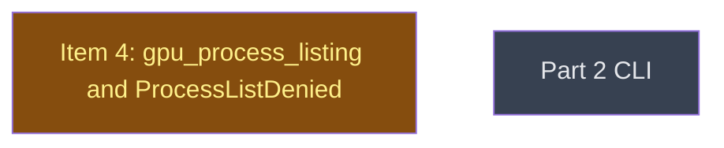

# Part 2 public API

## Context
This level runs after kinfo_enumeration. gpu_process_listing exposes the macOS backend's denied PIDs through the new public `gpu_process_listing` and `HypomnesisError::ProcessListDenied`. `cli/` consumes them one level deeper.

## Goal
Add the additive public API under the names the maintainer fixed (R03), without changing `gpu_processes`' signature.

## Pre-conditions
- [ ] kinfo_enumeration `done` and merged into `v0214-part2`

## Success Gates
- ⬜ gpu_process_listing `done`, and its verifier's findings adjudicated

## Status

## Nodes
| Node | Type | Status |
|:-----|:-----|:-------|
| `gpu_process_listing.md` | 📄 Leaf Task | 🔄 In Progress |
| `cli/` | 📁 Directory | ⬜ Planned |

## Amendment Log
| ID | Date | Source | Nodes Added | Rationale |
|:---|:-----|:-------|:------------|:----------|

## Progress
| Node | Branch | Commits | Notes |
|:-----|:-------|:--------|:------|
