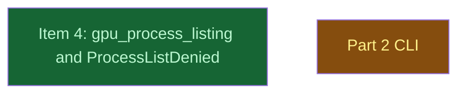

# Part 2 public API

## Context
This level runs after kinfo_enumeration. gpu_process_listing exposes the macOS backend's denied PIDs through the new public `gpu_process_listing` and `HypomnesisError::ProcessListDenied`. `cli/` consumes them one level deeper.

## Goal
Add the additive public API under the names the maintainer fixed (R03), without changing `gpu_processes`' signature.

## Pre-conditions
- [ ] kinfo_enumeration `done` and merged into `v0214-part2`

## Success Gates
- ⬜ gpu_process_listing `done`, and its verifier's findings adjudicated

## Status

## Nodes
| Node | Type | Status |
|:-----|:-----|:-------|
| `gpu_process_listing.md` | 📄 Leaf Task | ✅ Done |
| `cli/` | 📁 Directory | 🔄 In Progress |

## Amendment Log
| ID | Date | Source | Nodes Added | Rationale |
|:---|:-----|:-------|:------------|:----------|

## Progress
| Node | Branch | Commits | Notes |
|:-----|:-------|:--------|:------|
| `gpu_process_listing.md` | `task/gpu_process_listing` | 7e9e4aa, d774660 on v0214-part2 after A9 (slimmed in place; implemented as 3583ad1, e7d6c2d on 8519f1a; re-created by the trailer rewrite, trees identical; red 38c151b squashed into Step 2, A7 fixes folded in) | Sonnet implementer; doctest gate fixed in the spec (edition-2024 merged doctests, 6177425). Reviews: spec verifier PASS WITH NOTES (API additive only, seam untouched; 1 should-fix), test review PASS WITH NOTES (4 should-fix: a vacuous off-macOS test, no `denied=0` check unsandboxed, `Display` by word list, a saturation input a truncating cast passed). A7 adopted them; the call-site count stops at `mod tests` and the saturation input compiles on 32-bit targets (af92385); the A7 delta verifier PASS WITH NOTES (rustdoc-JSON API diff additive; `ProcessListDenied` count widened to qualified paths, 97f21c9; five docs gained the `denied > 0` condition). Full gate set green per commit, lib 146 native and Rosetta. Residuals for the PR body: the Metal arm's wiring is caught only by the `#[ignore]`d `tests/macos_sandbox.rs`; the off-macOS `ProcessListDenied` invariant only by the awk count; `compile_fail` passes for any compile error on stable. Trailers: `claude-sonnet-5-5`. |
