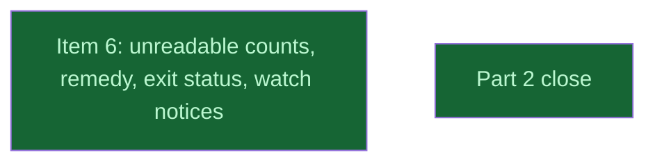

# Part 2 CLI

## Context
This level runs after gpu_process_listing. ps_watch_unreadable makes `hmn ps` and `hmn watch` report denied processes by count, with one platform remedy constant. `close/` follows with docs, the field check and the consistency pass.

## Goal
Turn the library's denial into the CLI's stated count, with a platform-correct remedy and exit codes that scripts can gate on.

## Pre-conditions
- [ ] gpu_process_listing `done` and merged into `v0214-part2`

## Success Gates
- ⬜ ps_watch_unreadable `done`, and its verifier's findings adjudicated

## Status

## Nodes
| Node | Type | Status |
|:-----|:-----|:-------|
| `ps_watch_unreadable.md` | 📄 Leaf Task | ✅ Done |
| `close/` | 📁 Directory | ✅ Done |

## Amendment Log
| ID | Date | Source | Nodes Added | Rationale |
|:---|:-----|:-------|:------------|:----------|

## Progress
| Node | Branch | Commits | Notes |
|:-----|:-------|:--------|:------|
| `ps_watch_unreadable.md` | `task/ps_watch_unreadable` | c07282f, 0964ad3, 6dc0237, then 2930664 `fix(watch)` (A9, R01 alignment), on v0214-part2 after A9 (slimmed in place; implemented as e0a4fc7, 890b5f6, 431f8c8 on e7d6c2d; red 6d5a322 squashed into Step 2, A8 fixes folded in; SHAs re-created by the trailer rewrite, trees identical) | Sonnet implementer; two extra pure seams (`no_processes_line`, `not_followed_notice`) so every watch line is pinned whole. Reviews: spec verifier PASS WITH NOTES (0 should-fix; seam exact, `1058 unreadable` = probe `denied=1058` in 4/4 runs; Windows/Linux `format_ps_summary_with` byte-identical over 432 cases), test review PASS WITH NOTES (3 should-fix). A8 adopted them; the A8 delta verifier (2 should-fix: `accept`'s own assert, a `NoGpuSource` pin lost to A8's rewrite) and a final check (0 should-fix) passed; two record notes fixed by the coordinator. Full gate set green per commit, lib 146 native and Rosetta, bin 280, `cli_ps` 8 + 1 ignored. Residuals: `run_watch` passing `&[]` to `missing_pid_notices` is caught by nothing; the `run_ps` accumulation and `denied_pid_notices` wiring only by CLI gates. |
