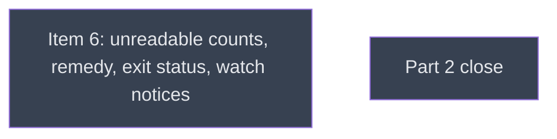

# Part 2 CLI

## Context
This level runs after gpu_process_listing. ps_watch_unreadable makes `hmn ps` and `hmn watch` report denied processes by count, with one platform remedy constant. `close/` follows with docs, the field check and the consistency pass.

## Goal
Turn the library's denial into the CLI's stated count, with a platform-correct remedy and exit codes that scripts can gate on.

## Pre-conditions
- [ ] gpu_process_listing `done` and merged into `v0214-part2`

## Success Gates
- ⬜ ps_watch_unreadable `done`, and its verifier's findings adjudicated

## Status

## Nodes
| Node | Type | Status |
|:-----|:-----|:-------|
| `ps_watch_unreadable.md` | 📄 Leaf Task | ⬜ Planned |
| `close/` | 📁 Directory | ⬜ Planned |

## Amendment Log
| ID | Date | Source | Nodes Added | Rationale |
|:---|:-----|:-------|:------------|:----------|

## Progress
| Node | Branch | Commits | Notes |
|:-----|:-------|:--------|:------|
