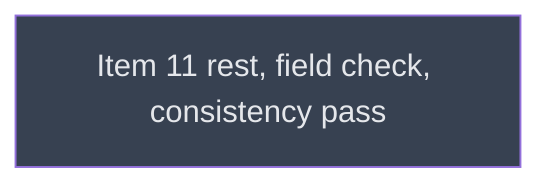

# Part 2 close

## Context
This is the last level of the campaign. part2_close rewrites the canonical limitation statement for PR C's behaviour, runs every *When it bites* row on hardware, makes a fresh-eyes consistency pass, and drops `__reports__/` as `f3c6010` did.

## Goal
Leave `v0214-part2` release-ready: docs true, every fixture re-run, and no development artifacts in the tree.

## Pre-conditions
- [ ] ps_watch_unreadable `done` and merged into `v0214-part2`

## Success Gates
- ⬜ part2_close `done`, and its verifier's findings adjudicated
- ⬜ `git ls-files __reports__ | wc -l` on `v0214-part2` → 0

## Status

## Nodes
| Node | Type | Status |
|:-----|:-----|:-------|
| `part2_close.md` | 📄 Leaf Task | ⬜ Planned |

## Amendment Log
| ID | Date | Source | Nodes Added | Rationale |
|:---|:-----|:-------|:------------|:----------|

## Progress
| Node | Branch | Commits | Notes |
|:-----|:-------|:--------|:------|
