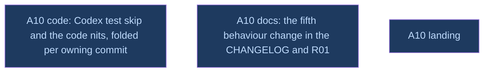

# A10: PR C review — template change documented, Codex test skip, nits

## Context
Amendment A10. PCfVW requested changes on PR C (mi-for-the-rust-of-us/hypomnesis#8, review 5453310396, 2026-10-08, on 1c97d88): two required changes and seven nits. Every fix folds into the commit that owns it (`fixup!` + autosquash), because the maintainer checked each of the 18 commits on its own and merges with a merge commit. review_code (an implementer) and review_docs (the coordinator) touch disjoint files and run in parallel. land/ consumes both.

## Goal
Answer the review in place: the same 18 commits, each green, and the 15 "at `6e7cf099e8`" mentions repointed.

## Pre-conditions
- [ ] Amendment A10 approved by the user (2026-10-09), source `__reports__/v0214_roadmap/17-amendment_a10_pr_c_review_v0.md`

## Success Gates
- ⬜ review_code, review_docs and land_and_reply `done` in `dirtree-rdm ls`
- ⬜ review_code's adversarial verifier answered. It attacks whether `Failed` can turn a real partial listing into `None`, whether the skip can hide a real failure (a stale errno, a non-probe path), whether the PID 0 filter changes a count, and whether each fixup leaves its owning commit coherent and true.
- ⬜ PR C's head carries every requested change, CI is green, and the reply is posted with the user's yes.

## Status

## Nodes
| Node | Type | Status |
|:-----|:-----|:-------|
| `review_code.md` | 📄 Leaf Task | 🔵 Amendment |
| `review_docs.md` | 📄 Leaf Task | 🔵 Amendment |
| `land/` | 📁 Directory | 🔵 Amendment |

## Amendment Log
| ID | Date | Source | Nodes Added | Rationale |
|:---|:-----|:-------|:------------|:----------|

## Progress
| Node | Branch | Commits | Notes |
|:-----|:-------|:--------|:------|
