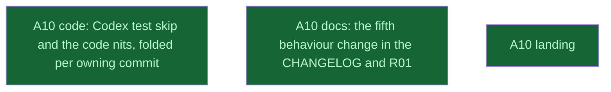

# A10: PR C review — template change documented, Codex test skip, nits

## Context
Amendment A10. PCfVW requested changes on PR C (mi-for-the-rust-of-us/hypomnesis#8, review 5453310396, 2026-10-08, on 1c97d88): two required changes and seven nits. Every fix folds into the commit that owns it (`fixup!` + autosquash), because the maintainer checked each of the 18 commits on its own and merges with a merge commit. review_code (an implementer) and review_docs (the coordinator) touch disjoint files and run in parallel. land/ consumes both.

## Goal
Answer the review in place: the same 18 commits, each green, and the 15 "at `6e7cf099e8`" mentions repointed.

## Pre-conditions
- [ ] Amendment A10 approved by the user (2026-10-09), source `__reports__/v0214_roadmap/17-amendment_a10_pr_c_review_v0.md`

## Success Gates
- ⬜ review_code, review_docs and land_and_reply `done` in `dirtree-rdm ls`
- ⬜ review_code's adversarial verifier answered. It attacks whether `Failed` can turn a real partial listing into `None`, whether the skip can hide a real failure (a stale errno, a non-probe path), whether the PID 0 filter changes a count, and whether each fixup leaves its owning commit coherent and true.
- ⬜ PR C's head carries every requested change, CI is green, and the reply is posted with the user's yes.

## Status

## Nodes
| Node | Type | Status |
|:-----|:-----|:-------|
| `review_code.md` | 📄 Leaf Task | ✅ Done |
| `review_docs.md` | 📄 Leaf Task | ✅ Done |
| `land/` | 📁 Directory | ✅ Done |

## Amendment Log
| ID | Date | Source | Nodes Added | Rationale |
|:---|:-----|:-------|:------------|:----------|

## Progress
| Node | Branch | Commits | Notes |
|:-----|:-------|:--------|:------|
| `review_code.md` | `task/a10_code` | 11 fixups folded into 6b73167, fc2c24c, 9891a3a, 3ae75ba (as 6103aac, 7e9e4aa, d774660, c07282f were) | Sonnet implementer; every gate PASS: Codex profile lib tests rc 101 (117 passed, 1 failed) → 0 with the skip line, unsandboxed no skip line, mutations (`failed > 0`, the 16-byte condition, the caller's own `Failed`) each fail a test, BORROW 14 → 0, Windows/Linux files untouched. Spec defect reported: one `// BORROW:` cannot cover four labels under the gate's two-line rule, so three lines. Adversarial Sonnet verifier: no behaviour defect (711 PIDs unsandboxed and 777 under Codex: 0 `Failed`; zombies `Gone`); F2 (a `decide_listing` paragraph pulled from 4f7a0dc into commit 4), F3 (skip-line wording), F5 (caller's own `Failed` untested) and F6 (`NoGpuSource` sentence read as exhaustive) fixed by the same implementer; F4 (stale `EPERM` under `--test-threads=1` after an `rc == 0` rejection) recorded as a residual. |
| `review_docs.md` | `task/a10_docs` | 4 fixups folded into 9891a3a, f23c0e7, f03298a (as d774660, 9bf9ab0, 6e7cf09 were) | Coordinator-written; trial autosquash with four expected conflicts, each resolved to its commit's own text. Coordinator integration review: "no read worked" was false when the caller's own read succeeds; "no other process was read" written in every commit by a tree filter (commits 1, 2, 4, 5); verifier F1's two stale messages (6103aac, 1c97d88) reworded. |
