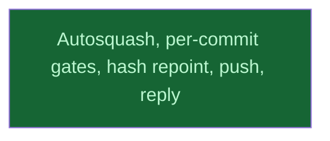

# A10 landing

## Context
The coordinator's level. It runs after review_code and review_docs, whose `fixup!` commits it folds into PR C's history. The hash repoint is the last rewrite before the push.

## Goal
Land A10 on `v0214-part2`, with the user's yes at each outward step.

## Pre-conditions
- [ ] review_code and review_docs `done`

## Success Gates
- ⬜ land_and_reply `done` in `dirtree-rdm ls`

## Status

## Nodes
| Node | Type | Status |
|:-----|:-----|:-------|
| `land_and_reply.md` | 📄 Leaf Task | ✅ Done |

## Amendment Log
| ID | Date | Source | Nodes Added | Rationale |
|:---|:-----|:-------|:------------|:----------|

## Progress
| Node | Branch | Commits | Notes |
|:-----|:-------|:--------|:------|
| `land_and_reply.md` | `v0214-part2` | 18 commits on b716087, head 2cc729d (force-pushed over 1c97d88 with the user's yes) | Subjects identical to 1c97d88's; per-commit gates (fmt, clippy native and linux, tests) green on all 18; full gate set green at the head (1.99.0 current and 1.88, doc, no-default-features, Rosetta lib, Codex profile). Hash repoint: 15 mentions and the drop message `6e7cf099e8` → `f03298a7bb` (same 20 `field_check_v0213` files). CI 8/8 green. Reply posted with the user's yes (issuecomment-6075450645); the user re-requests review. |
