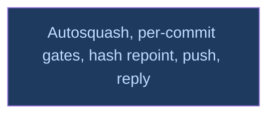

# A10 landing

## Context
The coordinator's level. It runs after review_code and review_docs, whose `fixup!` commits it folds into PR C's history. The hash repoint is the last rewrite before the push.

## Goal
Land A10 on `v0214-part2`, with the user's yes at each outward step.

## Pre-conditions
- [ ] review_code and review_docs `done`

## Success Gates
- ⬜ land_and_reply `done` in `dirtree-rdm ls`

## Status

## Nodes
| Node | Type | Status |
|:-----|:-----|:-------|
| `land_and_reply.md` | 📄 Leaf Task | 🔵 Amendment |

## Amendment Log
| ID | Date | Source | Nodes Added | Rationale |
|:---|:-----|:-------|:------------|:----------|

## Progress
| Node | Branch | Commits | Notes |
|:-----|:-------|:--------|:------|
